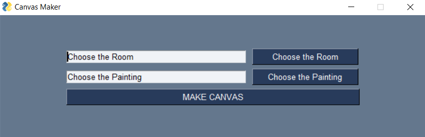

# Canvas Maker


## Introduction

This is a Python script that uses the PySimpleGUI library to create a graphical user interface (GUI) for a program that allows users to select an image of a room and an image of a painting, and then automatically pastes the painting onto the wall of the room in the image.

## Requirements

To use this script, you will need to have the following installed:

- Python 3
- PySimpleGUI
- OpenCV
- NumPy
- Pillow (PIL)

## Installation

To install the required packages, run the following command:

```pip install -r requirements.txt```

## Usage

To run the script, use the following command:

```python canvas_maker.py```

This will open the GUI, which will allow you to select the images of the room and the painting. Once you have selected the images, click the "MAKE CANVAS" button to paste the painting onto the wall of the room. The resulting image will be displayed and saved to the "temp" directory.

## Functions

The script includes the following functions:

- `resize_by_percentage(image, outfile, percentage)`: This function resizes an image by a specified percentage.
- `convertImage()`: This function converts an image to have a transparent background.
- `paste()`: This function pastes one image onto another image.
- `pastam(x, y)`: This function pastes an image onto a specific location on another image.

## Demo
[](https://www.youtube.com/watch?v=tM6KFKM0MS0)

## Menu


